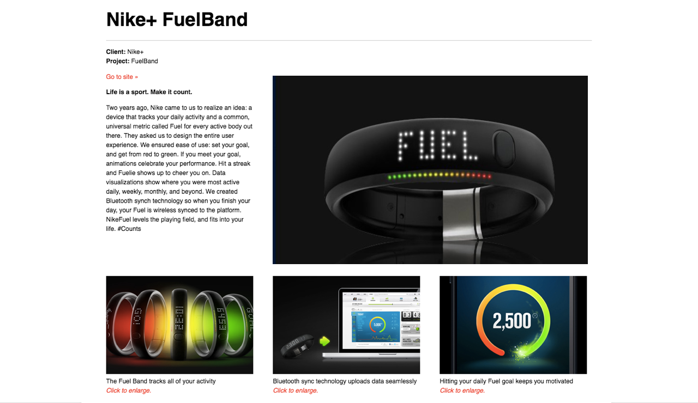

# Flexbox Layouts - Nike Fuelband

## Context

You are a front-end developer working for a UX agency who is looking to create a page to summarize their Nike Fuel Band campaign. The designer has provided you with a mockup for how the page should look and expects you to reproduce the design faithfully using HTML + CSS.

## The Assignment

Use HTML + CSS to implement the designer's styles on a static web page that represents the designer's mockup.

## Deliverables
- an `index.html` file with the content that links to the page's styles in a `styles.css` file
- a github repository named `flexbox-layouts-nike-fuelband`


## Setup Instructions
1. In terminal:
  ```sh
  # (1) Create a new directory in `~/muktek/assignments` called `flexbox-layouts-nike-fuelband` and cd into the project directory
  mkdir ~/muktek/assignments/flexbox-layouts-nike-fuelband
  cd ~/muktek/flexbox-layouts-nike-fuelband

  # (2) Download the image files and unzip
  curl https://raw.githubusercontent.com/muktek/assignment--flexbox-layout-nike-fuelband/master/project-images.zip > project-images.zip
  unzip project-images.zip

  # (3) Create index.html file and in a 'css' directory, the style.css file
  touch index.html
  mkdir css
  touch ./css/style.css
  ```

2. Inside your `index.html` file, make sure you have the proper `<!DOCTYPE>` declaration, the proper html format, and the `<head>` and `<body>` elements.

3. In your `style.css` external stylesheet file. Make sure all elements have box-sizing border box. It is also a good idea to apply an initial background color to the body to make sure your stylesheet is properly link.

  ```css
  * {
    box-sizing: border-box
  }

  /* TEST to confirm .css file is linked. Delete later. */
  body {
    background: lightyellow;
  }
  ```

4. Provide a link (`<link rel="stylesheet" href="./css/style.css">`) in the `<head>` of your `index.html` file to your external `style.css` file. When you refresh the page, you should see a yellow background.

5. Start writing your HTML + CSS to create the mock up.


### Mockup



### Designer Specs
```
font-family: Helvetica, Arial, sans-serif;
```


### Landing Page - Copywriting
```
Client: Nike +
Project: Fuel Band

Life is a sport. Make it count.

Two years ago Nike came to us to realize an idea: a device that tracks your daily activity and a common universal metric called Fuel for every active body out there. They asked us to design the entire user experience. We ensured ease of use: set your goal, animations celebrate your performance. Hit a streak and Fuelie shows up to cheer you on. Data visualization show where you were most active daily, weekly, monthly, and beyond. We created Bluetooth synch technology so when you finish your day, your Fuel is wireless synced to the platform. NikeFuel levels the playing field, and fits into your life. #Counts


=====
The Fuel Band tracks all of your activity
Click to enlarge

Bluetooth sync technology uploads data seamlessly
Click to enlarge.

Hitting your daily Fuel goal keeps you motivated
Click to enlarge.
```
